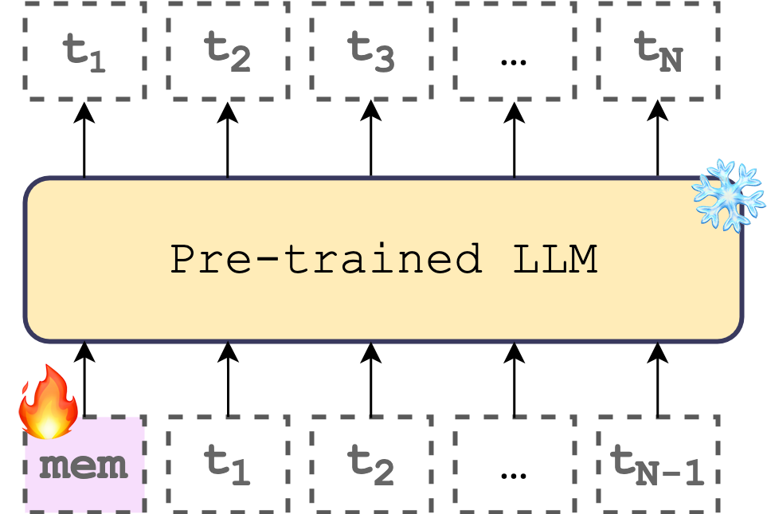
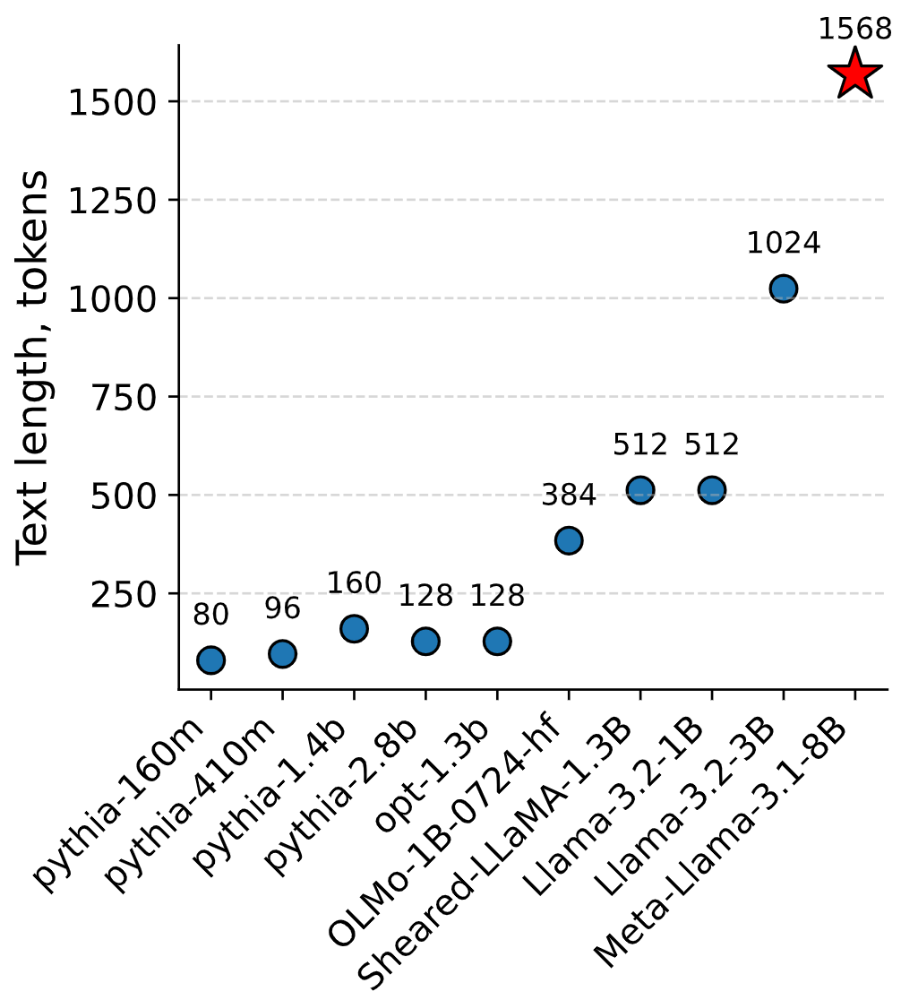

# Exploring Language Models Embeddings Space Capacity

This repository contains code and notebooks used to make plots for the paper:

Kuratov, Y., Arkhipov, M., Bulatov, A., Burtsev, M., "Cramming 1568 Tokens into a Single Vector and Back Again: Exploring the Limits of Embedding Space Capacity"

Our experiments show that a single Llama-3.1-8B input vector can compress and subsequently decode text sequences of over 1,500 tokens. Moreover, this capacity increases nearly linearly when multiple vectors are used.


<p align="center">
  
  
</p>

**Left**: Compressing text into a `[mem]` vector. The pre-trained LLM is frozen, and we only finetune one or multiple `[mem]` vectors to decode the sequence of tokens $[t_1, t_2, \ldots, t_N]$. `[mem]` vectors are trained for each text separately.

**Right**: How many tokens fit into a single input vector? We estimate maximum number of tokens that can be decoded from a single input vector across various language models

## Python scripts
- `train.py` - implements training loop for text compression into a vector.
- `model.py` - implementation of wrapper that adds trainable input vectors referred as `[mem]` to any model from HF, it is based on Recurrent Memory Transformer (RMT) [implementation](https://github.com/booydar/recurrent-memory-transformer).

## Scripts
- `scripts/run.*.sh` - bash scripts for different models, they include running experiments on PG-19, fanfics, and random texts with single or multiple trainable input `[mem]` vectors.

## Visualizations
- `notebooks/` - Folder with notebooks used for visualizations and collecting results.
- `notebooks/ablation_analyze_results.ipynb` - Table 1, Figure 3, Figure 6. Analysis of compression, capacity in tokens, capacity in terms of entropy.
- `notebooks/plot_length_model_brief.ipynb` - Figure 1, text compression results on PG-19.
- `notebooks/plot_length_vs_n_mem_tokens.ipynb` - Figure 4, scaling compression and number of trainable `[mem]` vectors.
- `notebooks/plot_model_theor_capacity_vs_actual.ipynb` - Figure 5, Theoretical capacity vs empirical.

## Citation
```
@misc{kuratov2025cramming,
    title={Cramming 1568 Tokens into a Single Vector and Back Again: Exploring the Limits of Embedding Space Capacity},
    author={Yuri Kuratov and Mikhail Arkhipov and Aydar Bulatov and Mikhail Burtsev},
    year={2025},
    eprint={2502.13063},
    archivePrefix={arXiv},
    primaryClass={cs.CL}
}
```
